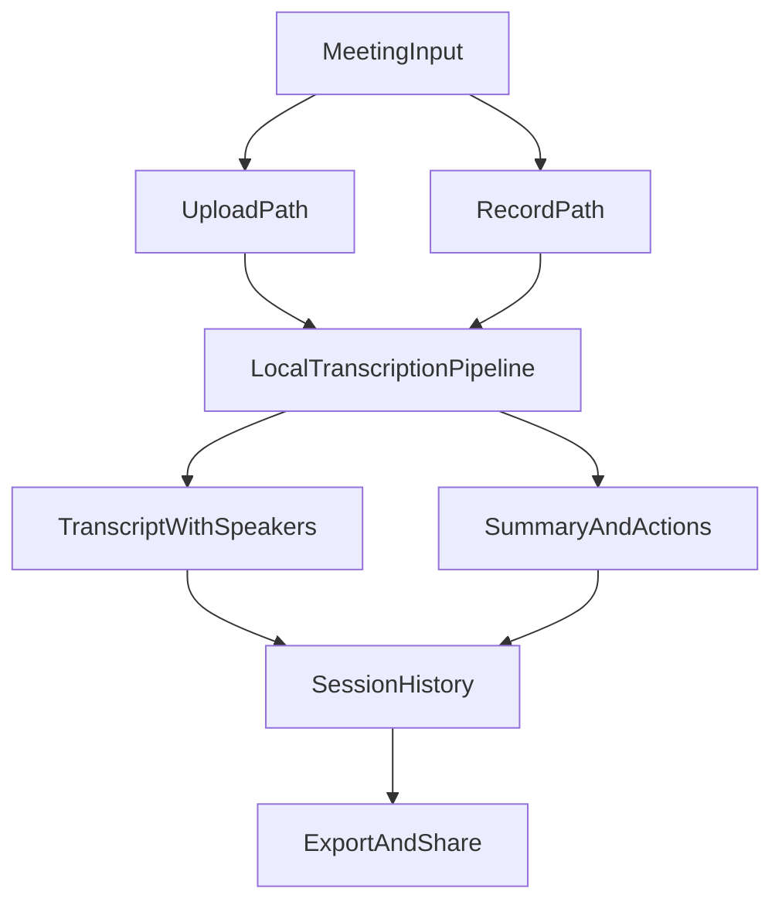

# Local Transcription Meeting-Only Reshape Plan

## Product Decisions Locked
- Product scope: meeting transcription only; remove live transcription UX and behavior.
- Platform: desktop-only.
- Input paths: support upload + in-app recording; Google Meet/Workspace is the first integration target.
- Output expectations: raw transcript + speaker labeling + summary/actions all required for v1 quality.
- UX depth: visual refresh (not full information architecture rewrite).
- Delivery: quality-first with flexible timeline.

## Implementation Strategy

### 1) Remove Live Mode End-to-End
- Remove live tab/state in renderer and make meeting flow the only recording experience.
- Simplify capture contracts to meeting profile only and remove realtime queue/profile branches.
- Keep history persistence as default post-capture behavior for all sessions.

Primary files:
- [`/home/avdhut/exp/local-transcription/src/renderer/src/components/RecordingHubView.tsx`](/home/avdhut/exp/local-transcription/src/renderer/src/components/RecordingHubView.tsx)
- [`/home/avdhut/exp/local-transcription/src/renderer/src/contexts/NavigationContext.tsx`](/home/avdhut/exp/local-transcription/src/renderer/src/contexts/NavigationContext.tsx)
- [`/home/avdhut/exp/local-transcription/src/renderer/src/contexts/TranscriptContext.tsx`](/home/avdhut/exp/local-transcription/src/renderer/src/contexts/TranscriptContext.tsx)
- [`/home/avdhut/exp/local-transcription/src/renderer/src/contexts/RecordingContext.tsx`](/home/avdhut/exp/local-transcription/src/renderer/src/contexts/RecordingContext.tsx)
- [`/home/avdhut/exp/local-transcription/src/shared/types.ts`](/home/avdhut/exp/local-transcription/src/shared/types.ts)
- [`/home/avdhut/exp/local-transcription/src/main/ipc/handlers.ts`](/home/avdhut/exp/local-transcription/src/main/ipc/handlers.ts)
- [`/home/avdhut/exp/local-transcription/src/main/audio/AudioCapture.ts`](/home/avdhut/exp/local-transcription/src/main/audio/AudioCapture.ts)
- [`/home/avdhut/exp/local-transcription/src/main/index.ts`](/home/avdhut/exp/local-transcription/src/main/index.ts)

### 2) Add Explicit Meeting Upload Workflow (Missing Today)
- Introduce file-upload entry in meeting workspace.
- Add IPC API for selecting and transcribing local meeting files.
- Reuse existing queue/engine/session-save pipeline so uploaded files land in history with the same output contract.

Primary files:
- [`/home/avdhut/exp/local-transcription/src/preload/index.ts`](/home/avdhut/exp/local-transcription/src/preload/index.ts)
- [`/home/avdhut/exp/local-transcription/src/main/ipc/handlers.ts`](/home/avdhut/exp/local-transcription/src/main/ipc/handlers.ts)
- [`/home/avdhut/exp/local-transcription/src/main/index.ts`](/home/avdhut/exp/local-transcription/src/main/index.ts)
- [`/home/avdhut/exp/local-transcription/src/renderer/src/components/RecordingHubView.tsx`](/home/avdhut/exp/local-transcription/src/renderer/src/components/RecordingHubView.tsx)

### 3) Visual Refresh Without IA Rewrite
- Refresh shell, meeting workspace, history, models, and settings visuals via shared design tokens and component primitives.
- Standardize spacing, typography, cards, status chips, and primary actions across key screens.

Primary files:
- [`/home/avdhut/exp/local-transcription/src/renderer/src/components/AppShell.tsx`](/home/avdhut/exp/local-transcription/src/renderer/src/components/AppShell.tsx)
- [`/home/avdhut/exp/local-transcription/src/renderer/src/components/RecordingHubView.tsx`](/home/avdhut/exp/local-transcription/src/renderer/src/components/RecordingHubView.tsx)
- [`/home/avdhut/exp/local-transcription/src/renderer/src/components/HistoryView.tsx`](/home/avdhut/exp/local-transcription/src/renderer/src/components/HistoryView.tsx)
- [`/home/avdhut/exp/local-transcription/src/renderer/src/components/HistorySidebarArchive.tsx`](/home/avdhut/exp/local-transcription/src/renderer/src/components/HistorySidebarArchive.tsx)
- [`/home/avdhut/exp/local-transcription/src/renderer/src/components/ModelsView.tsx`](/home/avdhut/exp/local-transcription/src/renderer/src/components/ModelsView.tsx)
- [`/home/avdhut/exp/local-transcription/src/renderer/src/components/SettingsView.tsx`](/home/avdhut/exp/local-transcription/src/renderer/src/components/SettingsView.tsx)
- [`/home/avdhut/exp/local-transcription/src/renderer/src/globals.css`](/home/avdhut/exp/local-transcription/src/renderer/src/globals.css)
- [`/home/avdhut/exp/local-transcription/tailwind.config.js`](/home/avdhut/exp/local-transcription/tailwind.config.js)

### 4) Google Meet/Workspace Integration as Controlled Follow-Up
- Design integration seam and abstraction first (connector interface + import pipeline contract).
- Implement Google-first connector behind feature flag, preserving local-first defaults.

Primary files to add/modify (proposed):
- [`/home/avdhut/exp/local-transcription/src/main/integrations/googleWorkspace/*`](/home/avdhut/exp/local-transcription/src/main/integrations/googleWorkspace/*)
- [`/home/avdhut/exp/local-transcription/src/main/ipc/handlers.ts`](/home/avdhut/exp/local-transcription/src/main/ipc/handlers.ts)
- [`/home/avdhut/exp/local-transcription/src/shared/types.ts`](/home/avdhut/exp/local-transcription/src/shared/types.ts)

## Execution Phases
- Phase A: Remove live mode and stabilize meeting-only capture pipeline.
- Phase B: Add upload-to-transcribe flow and ensure parity with recording outputs/history.
- Phase C: Apply visual refresh across core renderer screens.
- Phase D: Add Google Meet/Workspace connector as opt-in integration.

## Delivery Safeguards
- Keep all transcription processing local by default.
- Add regression tests for: meeting capture start/stop, upload transcription path, history save/export, diarization + summary generation visibility.
- Validate KPI instrumentation for `time_to_output` from input accepted to usable transcript+summary.

