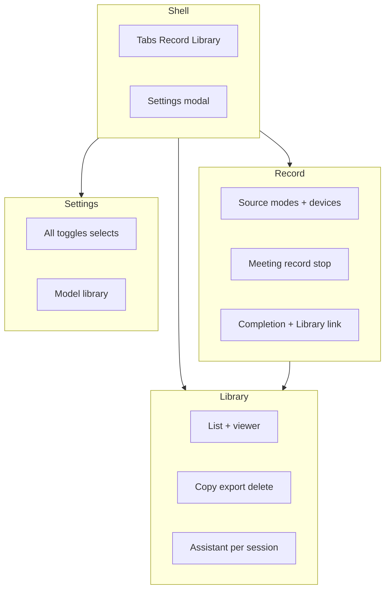

# Playwright feature-wise coverage (TDD)

## Subagent protocol (token + conflict control)

- **One subagent ↔ one todo id** from YAML frontmatter. Agent reads only that todo + this plan section + files it owns. Stops when its **Verify** line passes.
- **Parallel rule**: Agents must not edit the same file. Each todo names **one primary new spec file** (or Wave0: helper + smoke only). Product code changes (`data-testid`, E2E hook) stay **minimal** and scoped to that agent’s failing assertions only.
- **Waves** (launch subagents in parallel **within** a wave; wait for wave complete before next):
  - **Wave0 (serial, 1 agent)**: `e2e-00-launch-helper` — everyone else depends on `e2e/fixtures/launchApp.ts` existing.
  - **Wave1 (parallel, many agents)**: `e2e-01` through `e2e-09` — independent specs, fresh `userDataDir` per test as today. No shared state on disk between specs.
  - **Wave2 (parallel with handoff)**: `e2e-12` first if it adds fixture/hook; then `e2e-10`, `e2e-11` (need sessions). If `e2e-12` not ready, `e2e-10`/`11` use **self-contained seed** in their own `beforeAll` via IPC/file (document in that spec).
  - **Wave3 (optional / serial)**: `e2e-13` (autonav), `e2e-14` (doc note).
  - **Coordinator (1 agent, not parallel)**: `e2e-99-coordinator-verify` — full suite + CI.
- **Verify each todo**: After edits, subagent runs `pnpm build && playwright test <only-its-spec>` (or smoke for Wave0). Coordinator runs full `pnpm test:e2e` once.
- **Reduce tokens**: Subagent prompt = todo id + file path + “do not open unrelated specs”.

Baseline: [`e2e/app-smoke.spec.ts`](e2e/app-smoke.spec.ts), [`playwright.config.ts`](playwright.config.ts).

## Workflow

- **Per scenario**: Spec → `pnpm test:e2e` or `pnpm build && playwright test <file>` → red → fix.
- **Locators**: `getByRole` / visible text; add `data-testid` only when Radix or dynamic text flakes.

## Product facts (drives assertions)

- **Library “Quick Summary”**: [`LibrarySurface`](src/renderer/src/components/LibrarySurface.tsx) uses `selectedSession.preview` when set; else fallback string. **`preview`** = first **~160 chars** of stitched transcript in [`HistoryManager.saveSession`](src/main/history/HistoryManager.ts), not LLM summary.
- **Session list title**: [`generateLabel`](src/main/history/HistoryManager.ts) from transcript keywords / slice / `"Empty Recording"`.
- **Assistant**: [`ChatAssistant`](src/renderer/src/components/ChatAssistant.tsx) = **mock** reply after delay; assert UI only.
- **History persistence**: Main saves **meeting** sessions only after capture stops with segments ([`src/main/index.ts`](src/main/index.ts)).
- **Settings modal**: [`AppSettingsModal`](src/renderer/src/components/AppSettingsModal.tsx) **Save Settings** and **Cancel** both call `onClose`; each control already persists via [`SettingsContext.updateSettings`](src/renderer/src/contexts/SettingsContext.tsx). Tests should not expect a separate “commit all” behavior.
- **Live vs meeting**: [`RecordingContext.startCapture('live')`](src/renderer/src/contexts/RecordingContext.tsx) exists (mic-only mode, segments go to `liveSegments`), but [`RecordSurface`](src/renderer/src/components/RecordSurface.tsx) only exposes **Start Recording** → **`meeting`**. Catalog includes **optional** `page.evaluate` / dev-only hook to assert `live` path if you add UI later; otherwise skip.
- **Legacy components**: [`HistoryView`](src/renderer/src/components/HistoryView.tsx) / [`HistorySidebarArchive`](src/renderer/src/components/HistorySidebarArchive.tsx) are **not** mounted in [`App`](src/renderer/src/App.tsx) — **no E2E** unless wired back in.

## Complete E2E scenario catalog (do not skip)

Group by **surface**; use tags in test titles or `test.describe.configure` for `@slow` / `@fixture` / CI skip.

### Shell and navigation (@smoke)

- App launches; window title matches **LocalTranscribe** (or current branding); `#root` attached.
- **Record** tab shows record surface; **Library** tab shows library surface.
- **Settings** (gear) opens modal with **Settings** heading and `role="dialog"`.
- Close modal via **X**, **Cancel**, and **Save Settings** — all dismiss; reopen still works.
- Optional: [`AppShell`](src/renderer/src/components/AppShell.tsx) **auto-navigation** — when capture becomes active, user lands in record context; when meeting stops with segments, app can navigate to **Library** (assert with full flow or mocked capture).

### Record surface — gating and copy (@record)

- With **no model downloaded**: helper text mentions downloading model; **Settings** link in paragraph opens settings modal ([`RecordSurface`](src/renderer/src/components/RecordSurface.tsx)).
- With model downloaded but **incomplete sources**: “Select audio sources above.” **Start Recording** disabled.
- **Import File** visible, **disabled**, tooltip/copy says not available.

### Record surface — audio sources (@record, environment-dependent)

- **Audio Input** segmented control: **System**, **Mic**, **Mixed** — switching shows/hides **System Source** / **Microphone** [`DeviceSelect`](src/renderer/src/components/recording/RecordingSourceControls.tsx) per mode.
- **Refresh** devices button calls refresh; disabled while `isBusy` during operations (assert when possible).
- If capture fails: **destructive Alert** shows `errorMessage`.

### Record surface — meeting lifecycle (@record, @slow without fixture)

- **Start Recording** enabled when `canStartMeeting` (model + sources for current mode).
- While capturing: **Recording in progress** + **Stop Recording**; timer advances (loose assert or snapshot).
- **Stop** returns to idle; if transcript empty, no green completion card.
- With transcript segments after meeting stop: **Recording saved** card; **Open in Library** switches to Library tab.

### Model library inside Settings (@models, often @slow)

- Section **Transcription models** visible; [`ModelLibrarySection`](src/renderer/src/components/ModelsView.tsx): each model **role="button"** card.
- **Select** model: selected styling / border (visual or follow-up `getSelectedModel` via evaluate).
- Not downloaded + `downloadManaged`: **Download** → **Progress** + percent text; **Cancel** stops download.
- Downloaded: **Ready** + **Remove** (when allowed); not capturing.
- **downloadError**: destructive **Alert** visible.
- During download/capture: cards respect disabled/cursor rules.

### Library — list and empty states (@library)

- **No saved sessions**: “No saved sessions yet.”
- With sessions: left column **Transcriptions** list; each row shows **label**, date, duration.
- Entering Library with sessions **auto-selects first** ([`LibrarySurface` `useEffect`](src/renderer/src/components/LibrarySurface.tsx)).
- No selection edge: “Select a session to view transcript” when list empty or nothing selected (if achievable).

### Library — transcript detail (@library)

- [`TranscriptViewer`](src/renderer/src/components/TranscriptViewer.tsx): header **title**, date, duration line.
- **Quick Summary** card text = preview or fallback copy.
- **Full Transcript** lists segments or “No segments in this session.”
- **Copy Transcript** → button shows **Copied!** then reverts.
- **Export TXT** / **Export SRT** invoke handlers (native save dialog may block assertion — use mock dialog API if Playwright+Electron supports it, or assert **no throw** + status in app if surfaced).
- **Delete** removes session from list and clears detail (may need confirmation if added later).

### Library — assistant sidebar (@library)

- Panel **Assistant** / “Ask about this transcript”.
- Initial bubble references **current** `sessionTitle`.
- User sends message → loading indicator → assistant bubble (mock).
- **Per session in list**: repeat; ensure chat **resets** when switching sessions (`key={selectedSession.id}` on `ChatAssistant` if spec fails today).

### Settings — every control (@settings)

Same matrix as before; **one scenario per control** (toggle/select/shortcut), plus **Saving…** visibility when `settingsSaving` if observable.

- **General**: Start hidden, Launch on startup, Show tray icon (+ Linux restart hint), Unload model after idle, Voice-to-text shortcut capture, Mute while recording.
- **History**: Session limit, Auto-delete recordings, Keep starred recordings.
- **Assistant & integrations**: Assistant provider, Enable external assistant, Third-party integrations.

Persistence: optional second launch with **same** `userDataDir` + `getSettings` via `page.evaluate` for critical toggles.

### End-to-end transcribe → library (@slow or @fixture)

- Full path: sources + model + **meeting** record → **stop** → session appears → **label** + **Quick Summary** consistent with **preview** rules + **generateLabel**.
- **Fixture path**: inject session file + `history:list` refresh or fake `history:saved` for deterministic label/preview asserts.

### Optional — main process / OS integration (@optional-main)

Document or manual; Playwright Electron often **does not** fully cover:

- **Tray** show/hide, tray menu actions ([`src/main/index.ts`](src/main/index.ts)).
- **Global shortcut** start/stop when window unfocused.
- **Start hidden** / minimize to tray on launch.
- **Second instance** / single-instance behavior.

If needed later: dedicated integration job or `electronApp.evaluate` hooks in main with test env flag.

### Explicit non-features / gaps (assert negative or skip)

- **Import File**: must stay disabled until implemented.
- **Live** profile: no primary button — optional deep test only.
- **Cloud assistant / integrations** toggles: reserved — UI only unless backend wired.

## Files to add (1:1 with todos)

- `e2e/fixtures/launchApp.ts` + refactor [`e2e/app-smoke.spec.ts`](e2e/app-smoke.spec.ts) (`e2e-00`)
- `e2e/navigation.spec.ts` (`e2e-01`)
- `e2e/settings-general.spec.ts` (`e2e-02`)
- `e2e/settings-history.spec.ts` (`e2e-03`)
- `e2e/settings-assistant-integrations.spec.ts` (`e2e-04`)
- `e2e/record-gating.spec.ts` (`e2e-05`)
- `e2e/record-sources.spec.ts` (`e2e-06`)
- `e2e/record-meeting-lifecycle.spec.ts` (`e2e-07`)
- `e2e/models-settings.spec.ts` (`e2e-08`)
- `e2e/library-empty-list.spec.ts` (`e2e-09`)
- `e2e/library-transcript.spec.ts` (`e2e-10`)
- `e2e/library-assistant.spec.ts` (`e2e-11`)
- `e2e/transcribe-to-library.spec.ts` (`e2e-12`)
- `e2e/navigation-behavior.spec.ts` (`e2e-13`)

## Running

- Full: `pnpm test:e2e`
- One file: `pnpm build && playwright test e2e/<file>.spec.ts`
- CI split: `grep -E '@smoke|@fixture'` or project names in `playwright.config.ts` once tags exist

## Mermaid: coverage areas

Implementation: spawn **one subagent per todo** (after Wave0 completes), run **Verify** lines in parallel within each wave, then **e2e-99** coordinator for full `pnpm test:e2e`.
