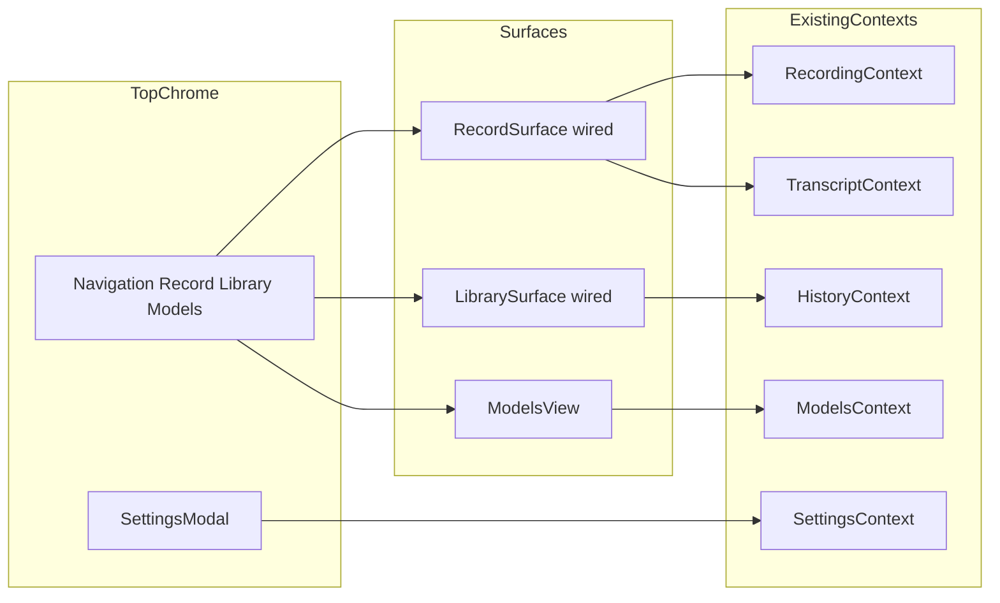

# Ref design integration (Electron + Tailwind v4)

## What ref provides

- **Spec**: [ref/TRANSCRIBE_UI_README.md](ref/TRANSCRIBE_UI_README.md) — two primary surfaces (Record, Library), settings modal, assistant in Library, feature gating.
- **Integration contract**: [ref/INTEGRATION_GUIDE.md](ref/INTEGRATION_GUIDE.md) — maps cleanly to Electron IPC; this repo already exposes a richer API via [`src/preload/index.ts`](src/preload/index.ts) (`window.api.*`), not REST.
- **Implementation**: App composition in [ref/app/page.tsx](ref/app/page.tsx), top bar in [ref/components/navigation.tsx](ref/components/navigation.tsx), surfaces in [ref/components/record-surface.tsx](ref/components/record-surface.tsx) / [ref/components/library-surface.tsx](ref/components/library-surface.tsx), design tokens in [ref/styles/globals.css](ref/styles/globals.css) (Tailwind v4 + oklch + `@theme inline`).
- **Gap vs shipped app**: Ref Record/Library are **stubs** (local `useState`, mock sessions). Current app has real state in [`RecordingContext`](src/renderer/src/contexts/RecordingContext.tsx), [`TranscriptContext`](src/renderer/src/contexts/TranscriptContext.tsx), [`HistoryContext`](src/renderer/src/contexts/HistoryContext.tsx), [`ModelsContext`](src/renderer/src/contexts/ModelsContext.tsx), [`SettingsContext`](src/renderer/src/contexts/SettingsContext.tsx) and persistence in main.

## Target information architecture (decided)

Ref only shows Record + Library. This repo **requires** a model-management area and full app settings. Without asking you for micro-decisions:

- **Top navigation** (ref style): **Record | Library | Models** + **Settings** as icon (same as ref gear).
- **Record**: ref-centered layout; **preserve meeting vs live** as an inner control (tabs or segmented control) reusing logic now in [`RecordingHubView.tsx`](src/renderer/src/components/RecordingHubView.tsx) (sources, model gate, segment streaming, live vs meeting profiles).
- **Library**: ref two-column pattern; **data from `HistoryContext` + `window.api`**, not ref’s `AppProvider` mock sessions.
- **Models**: relocate current [`ModelsView.tsx`](src/renderer/src/components/ModelsView.tsx) into the Models tab (same IPC, minimal layout tweaks for new shell).
- **Settings**: ref modal is only assistant/integration toggles; **fold existing [`SettingsView.tsx`](src/renderer/src/components/SettingsView.tsx) fields into a modal (or `Dialog` with scroll)** so tray/shortcut/history limits stay on the real `AppSettings` pipeline (`getSettings` / `setSettings`).

## Tailwind v4 migration (your choice)

Today: Tailwind **3.4** + [`tailwind.config.js`](tailwind.config.js) + HSL CSS vars in [`src/renderer/src/globals.css`](src/renderer/src/globals.css).

Target: align with ref’s **v4** setup:

- Bump `tailwindcss` to v4; add `@tailwindcss/postcss` and `tw-animate-css` (as in [ref/package.json](ref/package.json)).
- Replace [`postcss.config.js`](postcss.config.js) to use `@tailwindcss/postcss` (ref pattern: [ref/postcss.config.mjs](ref/postcss.config.mjs)).
- Move “source” styling to **CSS-first**: base [`src/renderer/src/globals.css`](src/renderer/src/globals.css) on [ref/styles/globals.css](ref/styles/globals.css) (`@import 'tailwindcss'`, `@theme inline`, oklch tokens). **Drop or drastically shrink** [`tailwind.config.js`](tailwind.config.js) (v4 prefers `@theme`; keep only if something still requires JS config after migration).
- **Fonts**: ref uses `next/font`. In Electron, load **Geist** via `@fontsource-variable/geist` + `@fontsource-variable/geist-mono` (or self-hosted `@font-face`) in renderer entry / HTML—no Next runtime.
- **shadcn / components.json**: [`components.json`](components.json) still points at `tailwind.config.js`. After v4, update the shadcn metadata to match the new CSS entry (per current shadcn v4 docs when running generator); avoid drift between CLI and hand-copied files.

## Component port strategy

1. **Copy ref `components/ui/*` + shared helpers** into [`src/renderer/src/components/ui/`](src/renderer/src/components/ui/) (repo currently has ~10 primitives; ref has full set). Resolve duplicates by **preferring ref versions** then fixing imports/types for React 18.
2. **Copy** [`ref/lib/utils.ts`](ref/lib/utils.ts) if it differs from [`src/renderer/src/lib/utils.ts`](src/renderer/src/lib/utils.ts).
3. **Port surface files** into `src/renderer/src/components/ref/` (or rename without `ref/` prefix once stable): `navigation.tsx`, `record-surface.tsx`, `library-surface.tsx`, `session-list.tsx`, `transcript-viewer.tsx`, `assistant-panel.tsx`, `chat-assistant.tsx`, `settings-modal.tsx`, etc.
4. Strip Next-only concerns: remove `'use client'` where noisy (optional); replace `@vercel/analytics`, `next/image`, `next/link` if any appear in ported files (grep during port).

## Wiring (replace stubs, keep IPC)

| Ref concept | Repo source of truth | Notes |
|-------------|---------------------|--------|
| `useRecording` stub | `RecordingContext` + `TranscriptContext` | Timer, start/stop, live text = existing handlers; move UI-only state out of `RecordingHubView` where helpful. |
| `AppProvider` sessions | `HistoryContext` + `HistorySession` / `HistorySessionMeta` | Map list + detail loading; delete/export already exist. |
| `settings-context` (feature flags) | **Extend** shared [`AppSettings`](src/shared/types.ts) + main [`SettingsManager`](src/main/settings/SettingsManager.ts) | **Name collision**: ref’s `AppSettings` ≠ repo’s `AppSettings`. Add a nested object e.g. `uiFeatures: { enableExternalAssistant, … }` or prefixed keys; migrate defaults so old installs get sane defaults. |
| Assistant / summarize | **Not in IPC today** | Keep Library assistant UI **feature-gated**; show “not available” or hide panel until `ipcMain.handle` + preload method exist (per [ref/INTEGRATION_GUIDE.md](ref/INTEGRATION_GUIDE.md)). |
| Import file button | **Not in IPC today** | Either disable with explanation or add `dialog.showOpenDialog` + new handler in a later slice (out of core UI port unless you expand scope mid-flight). |

## App entry changes

- Replace [`AppShell.tsx`](src/renderer/src/components/AppShell.tsx) usage with a new shell modeled on [ref/app/page.tsx](ref/app/page.tsx): providers remain in [`App.tsx`](src/renderer/src/App.tsx) (keep order: navigation/settings/models/recording/transcript/history as needed).
- **Remove or narrow** [`NavigationContext`](src/renderer/src/contexts/NavigationContext.tsx) if the new shell uses local `useState` for tabs; if other code still calls `navigateTo`, bridge the two (e.g. history auto-switch on save can set Library tab + selected session).
- Revisit the `useEffect` in `AppShell` that jumps views on stop capture—reimplement against **Library tab + `HistoryContext.selectSession`** when `onHistorySaved` fires.

## Verification

- `pnpm typecheck`
- `pnpm test`
- Manual smoke: start/stop meeting + live, model download, history list/detail, export txt/srt, settings persist across restart, tray/shortcut unchanged at IPC level.

## Non-goals for first integration slice

- Full summarization backend (local or cloud).
- File-import transcription pipeline (unless added explicitly later).
- Keeping the old orange “Bitcoin DeFi” palette as primary—visuals follow ref tokens (oklch) after v4 migration; you can tune `:root` later.
